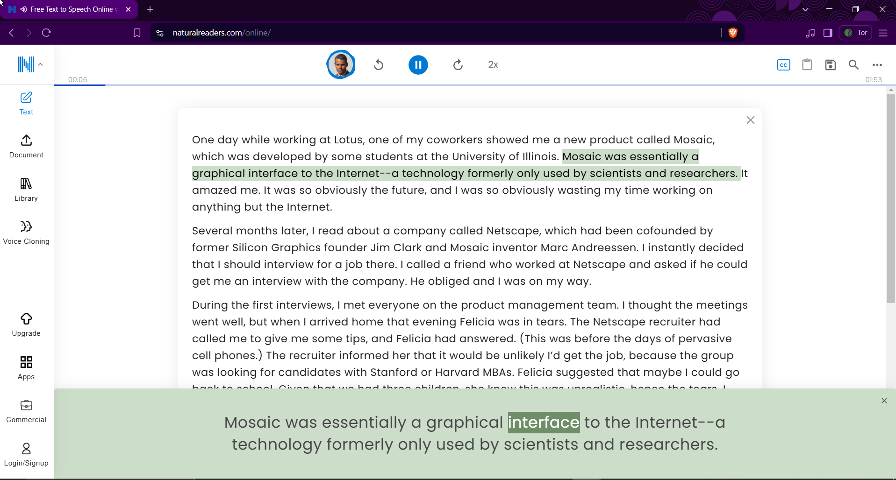

# 📚 Natural Ebook Reader Unlimited

**Natural Ebook Reader Unlimited** is a simple Python GUI tool that automates launching [NaturalReaders.com](https://www.naturalreaders.com/online/) through a **Brave Tor private window**, helping users restart their free premium voice session quickly.

This tool is especially helpful for students, visually impaired users, or anyone who relies on text-to-speech tools but cannot afford premium services.

---



---

## ✨ Why This Tool?

NaturalReaders offers **5 minutes of premium voice** to free users. Once that time is up, users must wait or upgrade to continue.

This tool,
- Routes through Brave's Tor mode to simulate a new session
- Automatically navigates to the site
- Allows users to reopen the premium reading window

💬 It's a valuable accessibility tool for:
- Students with limited resources
- Individuals with reading challenges
- Educational or temporary-use cases

> 🛑 **Note:** If you rely on this tool regularly and can afford it, please support the developers by purchasing their **Pro version**:  
👉 https://www.naturalreaders.com/online/

---

## 🔧 Features

- 🦁 One-click launch of Brave in **Tor private mode**
- 🌐 Automatically opens [NaturalReaders Online](https://www.naturalreaders.com/online/)
- 🎯 Uses keyboard simulation to enter the URL and start session
- ❌ Includes a button to close all Brave browser windows
- 🪟 Cross-platform GUI built with `tkinter`

---

## 📦 Requirements

- Python 3.8 or newer
- `pyautogui` for automation
- `tkinter` (built-in with Python on most systems)

### Install the required Python package:

```bash
pip install pyautogui
```

---

## 🛠️ Installation & Setup Guide

### ✅ Step 1: Install Python

1. Download Python from: https://www.python.org/downloads/
2. During installation, **check** ✅ **“Add Python to PATH”**
3. Confirm installation in Command Prompt:
   ```bash
   python --version
   ```

---

### ✅ Step 2: Clone or Download the Project

- Clone this repository using Git, or download the ZIP and extract it.

---

### ✅ Step 3: Set Your Brave Path

Edit `brave_tor_launcher.py` and make sure this line matches your system's Brave install:

```python
BRAVE_PATH = r"C:\Program Files\BraveSoftware\Brave-Browser\Application\brave.exe"
```

---

### ✅ Step 4: Run the Tool

```bash
python brave_tor_launcher.py
```

You’ll see a simple GUI with:
- **Launch via Tor**: opens the Natural Readers site through a Tor session
- **Close Brave Windows**: terminates all Brave windows for a fresh start

⚠️ **Don't move your mouse or type during automation (10–12 seconds).**

---

## 🖥️ Convert to Windows `.exe`

You can turn this into a portable `.exe` for quick access:

```bash
pip install pyinstaller
pyinstaller --onefile --noconsole brave_tor_launcher.py
```

Your `.exe` will be inside the `dist/` folder.

---

## 📁 Suggested Folder Structure

```
Natural-Ebook-Reader-Unlimited/
├── brave_tor_launcher.py
├── README.md
├── images/
│   └── banner.png   ← Github repo purpose
├── demo/
│   └── Natural-Reader-Lunch-V1.mp4   ← Github repo purpose
```

---

## 📜 License & Ethics

This tool is for **educational and accessibility purposes only**.  
It’s intended to help those who need temporary or limited access to reading support tools.

Please support the original developers if you find this useful long-term.

---

**Built with ❤️ to support accessibility, learning, and open digital tools.**
